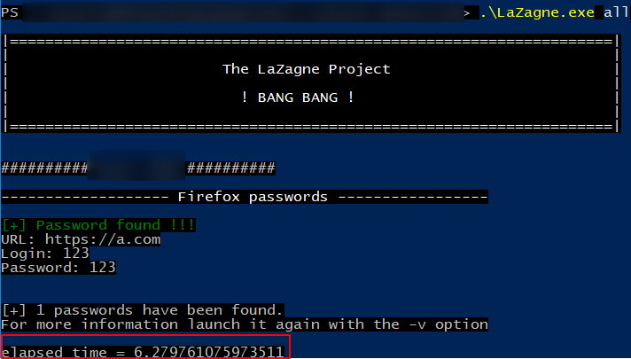

# Filesystem Audit-based Browser Stealer Detection

## Features
- Based on [sysmon-edr](https://github.com/ion-storm/sysmon-edr) by ion-storm.
- Using built-in telemetry data by enabling Audit FileSystem for sensitive browser data files.
- Detects and terminates abnormal browser credential data file access behaviors of suspicious processes.

## Usage
- Run install-svc.bat as administrator to configure filesystem audit for common browser data files and install a service that executes powershell_browser_monitor.ps1 to monitor browser data file access events.

## Limitations
- False positives: A valid third-party application attempts to access browser data files.
- Can be bypass: process injection, DLL sideloading...
- Event-based, so response actions (process termination) are executed after an application has already accessed browser data files but may be could prevent data exfiltration or other follow-up actions of malicious processes

Without detection, Stealer (LaZagne) run and then perform others behaviors..

With detection, Stealer (LaZagne) still run but could be terminate before perform other behaviors..

## Todo
- [ ] Reduce false positives: File signature verification, support configuration file for list file monitoring and whitelist patterns process.
- [ ] Support more applications: Discord, Telegram, and other web browsers.
- [ ] Add detection for injected processes: possibly using GetInjectedThreadEx.

# References
- https://github.com/ion-storm/sysmon-edr
- https://github.com/elastic/protections-artifacts/blob/main/behavior/rules/credential_access_access_to_browser_credentials_from_suspicious_memory.toml
- https://fourcore.io/blogs/threat-hunting-browser-credential-stealing
- https://attack.mitre.org/techniques/T1555/003/
